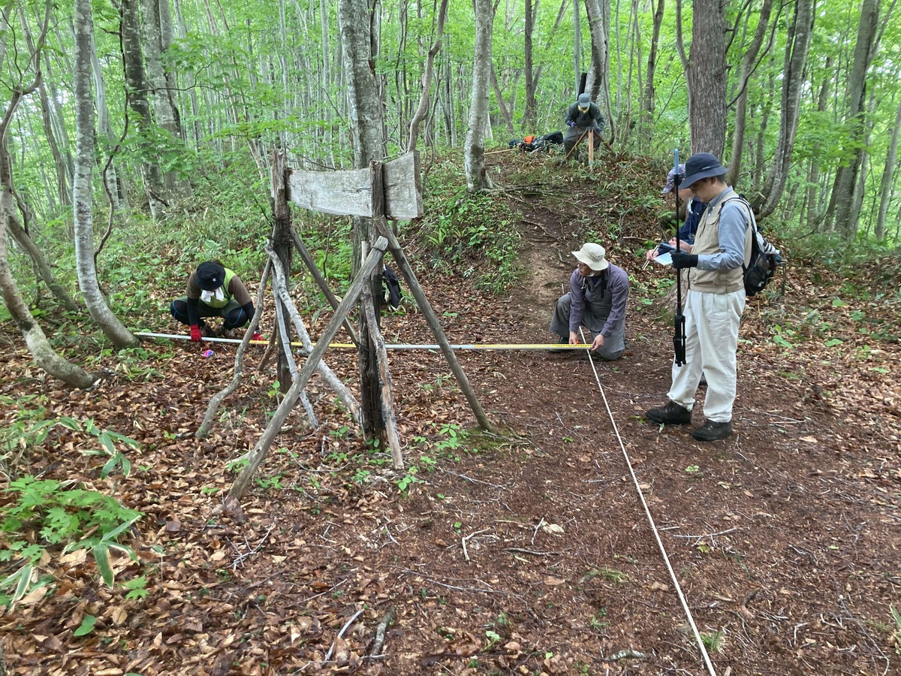

# 福島町殿様街道沿い伝砲台跡

## 概要

松前と函館を結ぶ通称「殿様街道」上に設置されたとされる砲台跡の調査です。現地の看板には「砲台は明治元年10月末頃作られ、砲・300匁2門設置」と記されています。松前藩によって明治元年の旧幕府軍の攻撃に備えて築造されたものと伝わっているようです。

## 調査の内容

調査参加者は箱館戦争戦跡プロジェクト代表野村祐一ほか6名です。

2023年5月20日10時15分頃に「殿様街道」に入山し、15分後の10時30分頃砲台跡に到着しました。図化、写真撮影準備として下草やリターの除去を行いました。

計測はiPad LiDARを用いました。

